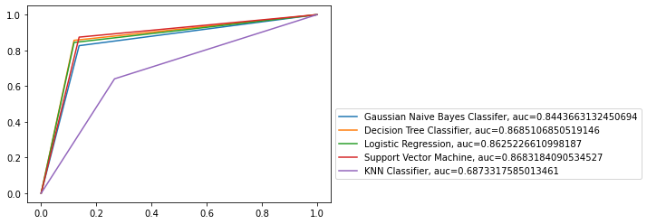

# Multi model heart disease prediction

## Description: 
  An analysis and comparison between various supervised machine learning models was performed on an extensive data set of heart-disease patients. SVM, KNN, Gaussian NB classifier,  Decision tree classifier and Logistic regression are the models that were used in the analysis. 
  
## Model Specifications:
Decision tree classifier :- Max depth = 4 , random state = 1
Logistic regression :- Max iterations = 140, random state = 0 
SVM :- kernel = linear
KNN classifier :-  number of neighbors = 8 
Gaussian NB :- default

## Dataset:  
	The dataset was obtained from https://www.kaggle.com/datasets. 11 predictor variables like RestingBP, Cholesterol, MaxHR etc were used to predict if an individual is prone to a heart disease.
  
## Output :  
  The SVM and the Decision tree classifier have the same high accuracy and the KNN classifier has the least accuracy.  
  
  

